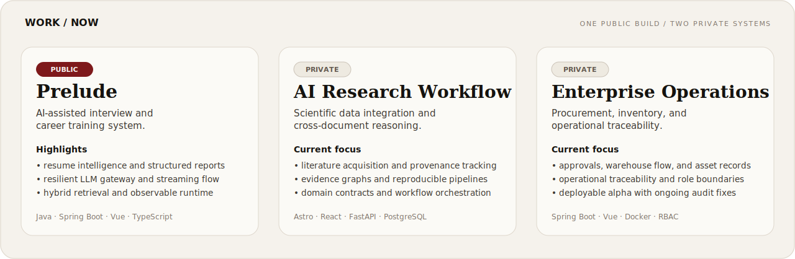
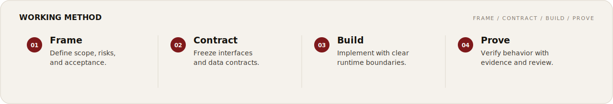

<picture>
  <source media="(prefers-color-scheme: dark)" srcset="./assets/profile/hero-dark.svg">
  <source media="(prefers-color-scheme: light)" srcset="./assets/profile/hero-light.svg">
  
</picture>

  <a href="https://github.com/zyyyyynnn/Prelude"><strong>PRELUDE</strong></a>
  &nbsp;&nbsp;·&nbsp;&nbsp;
  <a href="https://github.com/zyyyyynnn?tab=repositories"><strong>REPOSITORIES</strong></a>
  &nbsp;&nbsp;·&nbsp;&nbsp;
  <a href="https://github.com/zyyyyynnn/yyyyyynnn-portfolio"><strong>PORTFOLIO</strong></a>
  &nbsp;&nbsp;·&nbsp;&nbsp;
  <a href="mailto:1974447317@qq.com"><strong>EMAIL</strong></a>

I design and build full-stack systems where **product intent, architecture, data, and AI capabilities remain aligned** from the first contract to the final verification.

我关注的不只是功能能否运行，也包括边界是否清楚、链路是否可靠、结果是否能够被验证。

## 01 / Selected work

### [Prelude](https://github.com/zyyyyynnn/Prelude)

An evidence-driven interview and career-training system connecting resume intelligence, hybrid retrieval, simulated interviews, resilient model gateways, and iterative capability reports.

`Java 21` · `Spring Boot` · `Vue 3` · `TypeScript` · `MySQL` · `Redis` · `RabbitMQ` · `SSE` · `WebSocket` · `Docker`

- Resilient LLM integration with streaming, fallback, circuit breaking, and user-managed provider credentials.
- Keyword-and-vector hybrid retrieval with graceful degradation when embedding services are unavailable.
- A complete training loop from resume parsing and interview sessions to structured reports and capability analysis.
- Reproducible local environments, architecture documentation, CI gates, and observable runtime components.

[Repository ↗](https://github.com/zyyyyynnn/Prelude) · [Architecture ↗](https://github.com/zyyyyynnn/Prelude/tree/main/docs) · [API ↗](https://github.com/zyyyyynnn/Prelude/blob/main/docs/api.md)

## 02 / Current systems

<picture>
  <source media="(prefers-color-scheme: dark)" srcset="./assets/profile/workboard-dark.svg">
  <source media="(prefers-color-scheme: light)" srcset="./assets/profile/workboard-light.svg">
  
</picture>

**AI research workflow — private, active development**  
A reproducible workflow for scientific-data integration, literature acquisition, cross-document reasoning, provenance tracking, and evidence-graph construction.

**Enterprise operations system — private, active development**  
A multi-organization product covering procurement, approval flows, inventory, material usage, asset management, and operational traceability.

Private work is described at capability level only; implementation details remain inside their respective repositories.

## 03 / Engineering focus

<table>
<tr>
<td width="50%" valign="top">

**AI application infrastructure**

Streaming responses, provider gateways, structured outputs, retrieval, embeddings, BYOK, fallback paths, and failure recovery.

</td>
<td width="50%" valign="top">

**Full-stack product systems**

Frontend architecture, backend services, state and data models, authorization, workflow design, and product-quality boundaries.

</td>
</tr>
<tr>
<td width="50%" valign="top">

**Reliability engineering**

Circuit breaking, retries, asynchronous jobs, message queues, observability, security defaults, and CI quality gates.

</td>
<td width="50%" valign="top">

**Architecture and delivery**

PRD-to-implementation traceability, contract-first design, documentation governance, containerized environments, and reproducible acceptance.

</td>
</tr>
</table>

## 04 / Working method

<picture>
  <source media="(prefers-color-scheme: dark)" srcset="./assets/profile/method-dark.svg">
  <source media="(prefers-color-scheme: light)" srcset="./assets/profile/method-light.svg">
  
</picture>

I prefer systems that are explicit about what they promise, observable when they fail, and supported by evidence when they claim to work.

## 05 / Stack

**Languages**  
`Java` · `TypeScript` · `Python` · `SQL`

**Frontend**  
`Vue` · `React` · `Astro` · `Vite`

**Backend and data**  
`Spring Boot` · `FastAPI` · `MySQL` · `PostgreSQL` · `Redis` · `RabbitMQ`

**Systems**  
`Docker` · `REST` · `SSE` · `WebSocket` · `Prometheus` · `CI/CD`

**AI engineering**  
`LLM gateways` · `Retrieval` · `Embeddings` · `Structured outputs` · `Evaluation workflows`

---

  Structure before ornament. Evidence before claims.

