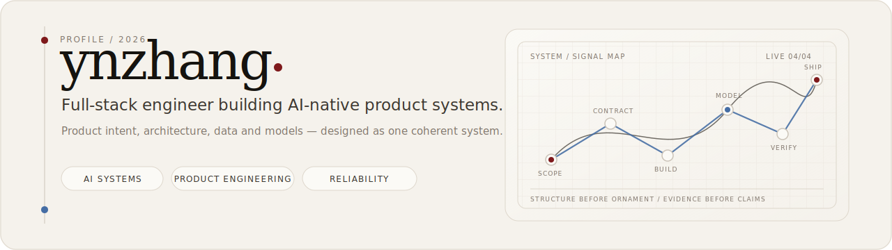
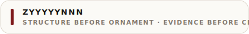

  

  <a href="#selected-work"><strong>SELECTED WORK</strong></a>
  &nbsp;&nbsp;·&nbsp;&nbsp;
  <a href="#now"><strong>NOW</strong></a>
  &nbsp;&nbsp;·&nbsp;&nbsp;
  <a href="#engineering-lens"><strong>ENGINEERING LENS</strong></a>
  &nbsp;&nbsp;·&nbsp;&nbsp;
  <a href="https://github.com/zyyyyynnn/yyyyyynnn-portfolio"><strong>PORTFOLIO</strong></a>
  &nbsp;&nbsp;·&nbsp;&nbsp;
  <a href="mailto:1974447317@qq.com"><strong>CONTACT</strong></a>

I build full-stack systems where **product intent, architecture, data, and AI capabilities stay aligned** from the first contract to the final verification.

我关注的不只是功能能否运行，也包括边界是否清楚、链路是否可靠、结果是否能够被验证。

## 01 / Selected work

### [Prelude](https://github.com/zyyyyynnn/Prelude)

PUBLIC · PRODUCT SYSTEM

*AI-assisted interview and career training system.*

An evidence-driven system connecting resume intelligence, simulated interviews, hybrid retrieval, resilient model gateways, structured reports, and capability tracking.

**What it demonstrates** — full-stack product architecture, streaming AI interaction, retrieval, reliability engineering, observability, and disciplined delivery.

`Java 21` · `Spring Boot` · `Vue 3` · `TypeScript` · `MySQL` · `Redis`

[Repository ↗](https://github.com/zyyyyynnn/Prelude) · [Architecture ↗](https://github.com/zyyyyynnn/Prelude/tree/main/docs) · [API ↗](https://github.com/zyyyyynnn/Prelude/blob/main/docs/api.md) · [Interfaces ↗](https://github.com/zyyyyynnn/Prelude#界面预览)

---

### [Shit Mountain](https://github.com/zyyyyynnn/Shit_mountain)

PUBLIC · OPEN SOURCE

*A runnable museum of code smells, anti-patterns, and refactoring escapes.*

A deliberately playful project where every bad example must remain explainable, executable, and paired with a safe route back to maintainable code.

**What it demonstrates** — code-review judgment, refactoring pedagogy, open-source structure, technical storytelling, and a distinct voice for engineering culture.

`Java` · `Code Review` · `Refactoring` · `Open Source`

[Repository ↗](https://github.com/zyyyyynnn/Shit_mountain) · [Exhibits ↗](https://github.com/zyyyyynnn/Shit_mountain/tree/main/exhibits) · [Contributing ↗](https://github.com/zyyyyynnn/Shit_mountain/blob/main/CONTRIBUTING.md)

## 02 / Now

> **AI research workflow** · `PRIVATE · ACTIVE`  
> Scientific-data integration, literature acquisition, cross-document reasoning, provenance tracking, and evidence-graph construction.

> **Enterprise operations system** · `PRIVATE · ALPHA`  
> Procurement, approval flows, inventory, asset management, operational traceability, and multi-organization boundaries.

Private work is described at capability level only; implementation details remain inside their respective repositories.

## 03 / Engineering lens

<table>
<tr>
<td width="50%" valign="top">

**01 · AI application infrastructure**

Model gateways, streaming responses, retrieval, embeddings, structured outputs, BYOK, fallback paths, and failure recovery.

</td>
<td width="50%" valign="top">

**02 · Full-stack product systems**

Frontend and backend boundaries, state, data models, authorization, workflows, and product-quality constraints.

</td>
</tr>
<tr>
<td width="50%" valign="top">

**03 · Reliability engineering**

Circuit breaking, asynchronous jobs, message queues, observability, security defaults, and CI quality gates.

</td>
<td width="50%" valign="top">

**04 · Architecture and delivery**

Contract-first design, documentation governance, containerized environments, and reproducible acceptance.

</td>
</tr>
</table>

  <strong>Frame the problem → Freeze the contract → Build the system → Prove the behavior</strong>

## 04 / Toolbox

**Product engineering**  
`Java` · `Spring Boot` · `TypeScript` · `Vue` · `React` · `FastAPI`

**Systems and data**  
`MySQL` · `PostgreSQL` · `Redis` · `RabbitMQ` · `Docker` · `Prometheus`

**AI application engineering**  
`LLM gateways` · `Streaming` · `Retrieval` · `Embeddings` · `Structured outputs`

## Elsewhere

The portfolio holds visual work and personal notes. The repositories hold source code, experiments, and ongoing systems.

  <a href="https://github.com/zyyyyynnn/yyyyyynnn-portfolio">Portfolio</a>
  &nbsp;&nbsp;·&nbsp;&nbsp;
  <a href="https://github.com/zyyyyynnn?tab=repositories">All repositories</a>
  &nbsp;&nbsp;·&nbsp;&nbsp;
  <a href="mailto:1974447317@qq.com">Email</a>

  

